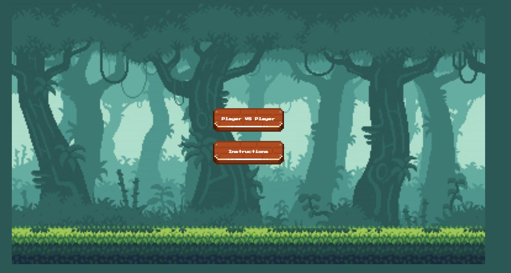
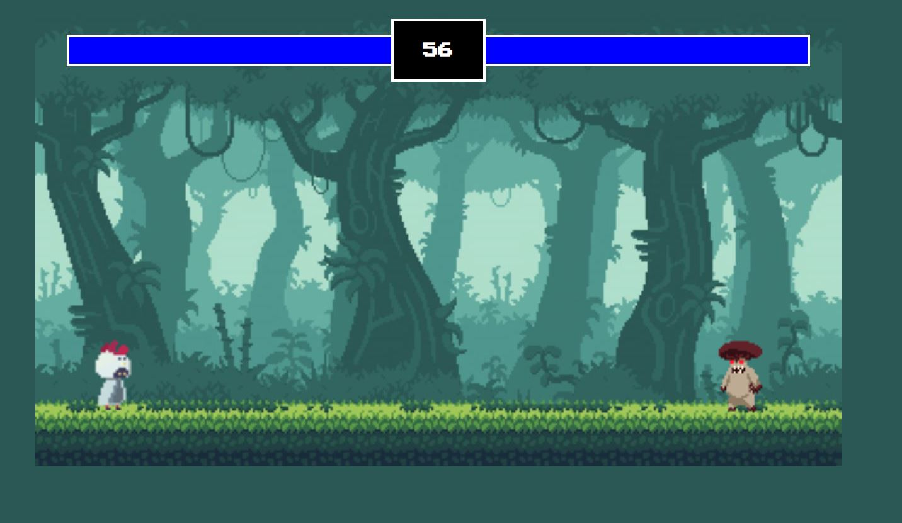
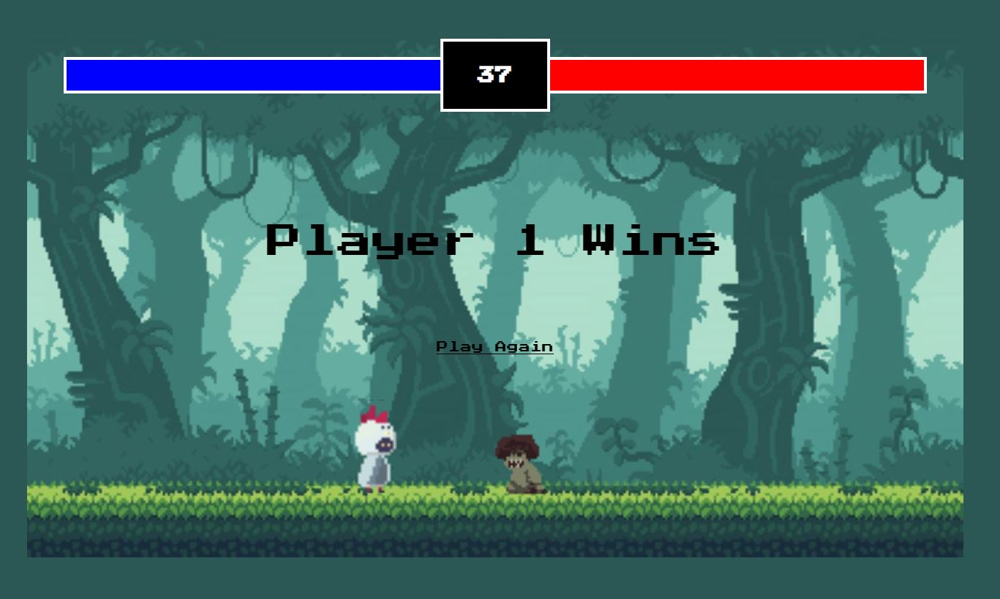

# Chicken Combat (JS Mini-game)

# Live Website:

Live: https://chicken-combat.netlify.app

# Game Description:

Chicken Combat is a fun and exciting player vs player (PvP) fighter game developed using JavaScript. In this game, players1 control a chicken and engage in one-on-one combat against either another player or an AI opponent controlling a mushroom monster.

# Control:

Player 1

- A to move left
- D to move right
- W to jump
- Space to Attack

Player 2

- Left Arrow to move left
- Right Arrow to move right
- Up Arrow to jump
- Enter to attack

# fun facts

- Player 1 (chicken) will have lower damage, but faster attack speed.

- Player 2 (Mushroom Monster) will have higher damage, but slower attack speed

# Screenshots

# Technologies:

- HTML
- CSS
- Javascript
- Canvas
